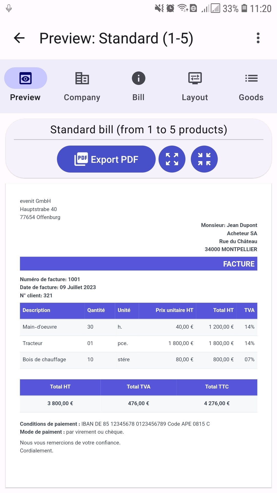
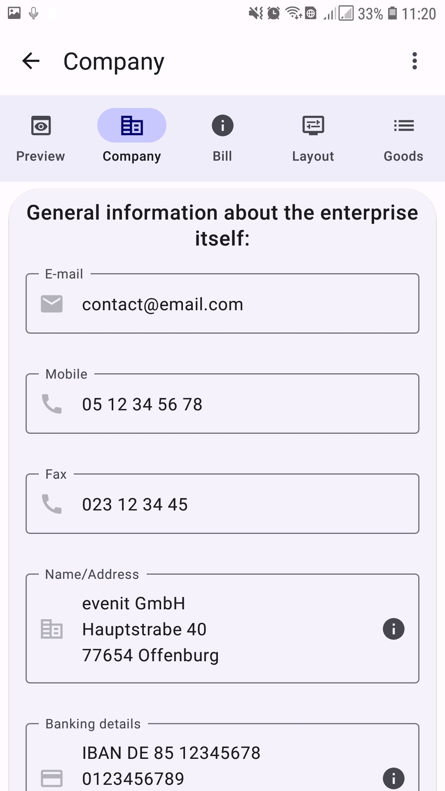
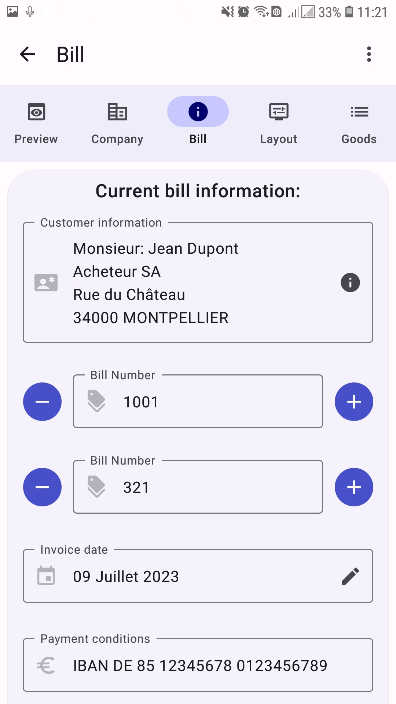
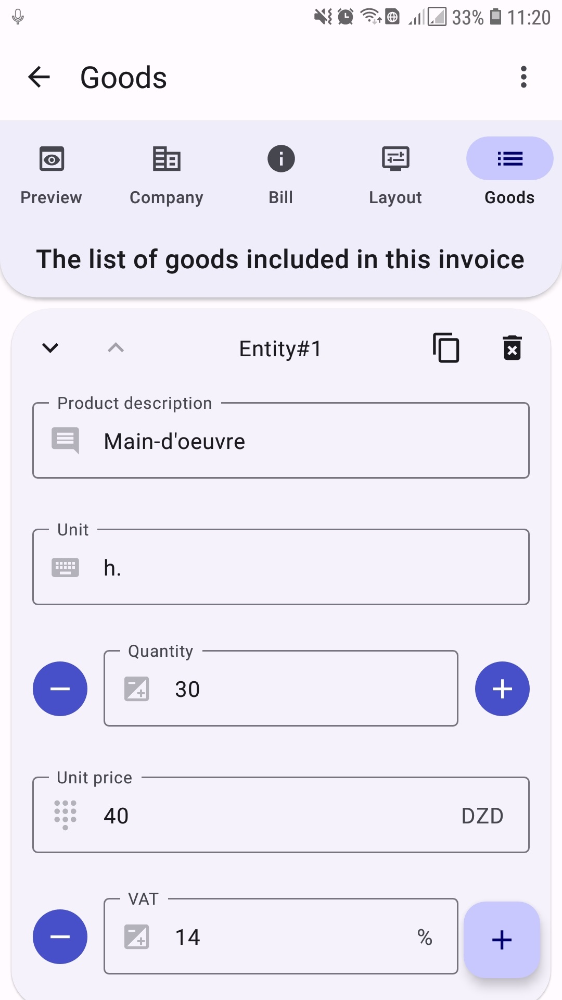
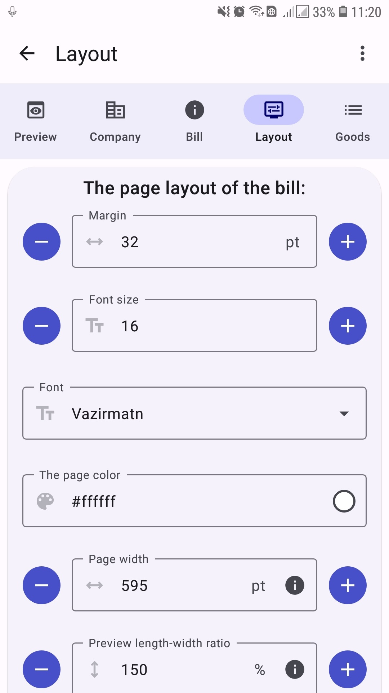
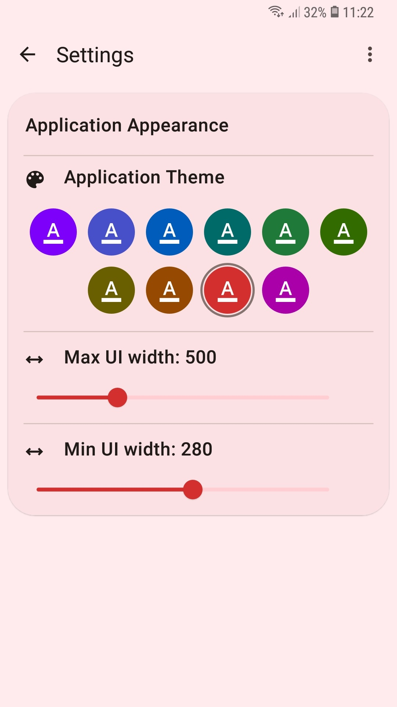

## Overview

Reporter is an Android application designed as a lightweight invoice manager, originally created exclusively for one specific client. However, it is fairly flexible and can be used to generate any arbitrary PDF document by importing its template and filling out a few input forms.

This application is a [Free Software](https://www.gnu.org/philosophy/free-sw.html). We actually charge per each custom template we create rather than for app downloads or usage. [Creating a custom template](#creating-a-custom-template) should be a straightforward task for anyone with some experience in web development since a template is essentially a zip file that contains a webpage, a few resource files (such as icons, fonts, etc.), and some extra metadata.

## Application features

When a template is selected, the application dynamically generates the necessary input from the UI. Templates vary in complexity, with some offering great flexibility and a multitude of input options, while others are simple and designed for a specific use case.

This is how an [example template](https://drive.google.com/drive/folders/17v9MWlNCxS1AUNLK7ZxZLpSMLmRxgOyy?usp=drive_link) (simple sales invoice) looks like when imported:

The first tab is common to all templates. It provides a live preview of the PDF you are generating.

This tab takes input about the seller's company. This info is grouped together because it rarely changes from one PDF to another.

This form contains important information that is likely to change for every bill, like the "bill number" and "billing date", etc.

This is the main input of the invoice, the list of products to be included in the bill.

This template has some basic layout settings that can be used to customize the appearance of the generated PDF.

The app itself has a simple settings page where you can change the Look and feel of the whole app.

## Implementation details

The whole app is written in Kotlin using [Jetpack Compose](https://developer.android.com/jetpack/compose) with the modern [Material 3 design](https://m3.material.io/).

Since this project is simple, we wanted to make it standalone and easy to build/clone, so instead of using some private utility libraries, we just copied the needed classes altogether.

## Building the application

To build the app, first, create a [firebase](https://firebase.google.com/) project, then download your `google-services.json` file and copy it to the root dir of the project. After that, you can use the Gradle wrapper: `gradlew` to build the project or just import it to an IDE like Android studio.

## Creating a custom template

Creating a template file is as easy as writing a webpage using [Pebble Template](https://pebbletemplates.io/). However, there are many tips and tricks that you need to be aware of while writing your own template.

If anyone is actually interested, we would gladly write a comprehensive guide about creating custom templates, including a desktop tool that provides a live preview of the template while you are editing it, just [Contact Us](#contact-us).

## License

This project is licensed under the [GNU General Public License, Version 3](https://www.gnu.org/licenses/gpl-3.0.en.html) - see the [LICENSE](LICENSE.txt) file for details.

The GNU GPL v3 is a strong copyleft license that ensures anyone who receives a copy of your software also gets the source code and the same rights to use, modify, and distribute the software.

### Permissions

- You are free to use, modify, and distribute this software.
- You can distribute your own modified versions, but they must also be licensed under the GNU GPL v3.
- This license ensures that users have the same rights you received when using this software.

### Limitations

- You must make any modifications to the source code available under the same GNU GPL v3 license.
- If you distribute this software, you must provide the source code to recipients.
- This license is intended to protect users' freedom, so any restrictions on these freedoms are not allowed.

*For a full understanding of your rights and responsibilities, please refer to the [official license](https://www.gnu.org/licenses/gpl-3.0.en.html).*

## Contact Us

If you have any questions or inquiries about this project, please don't hesitate to contact the main developer at [youcef-debbah@hotmail.com](mailto:youcef-debbah@hotmail.com).
